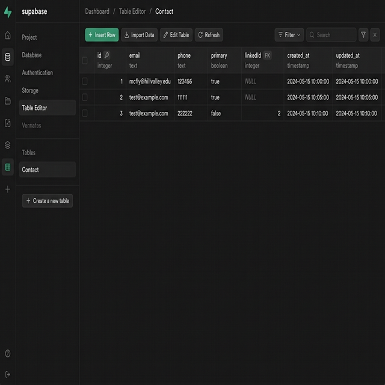
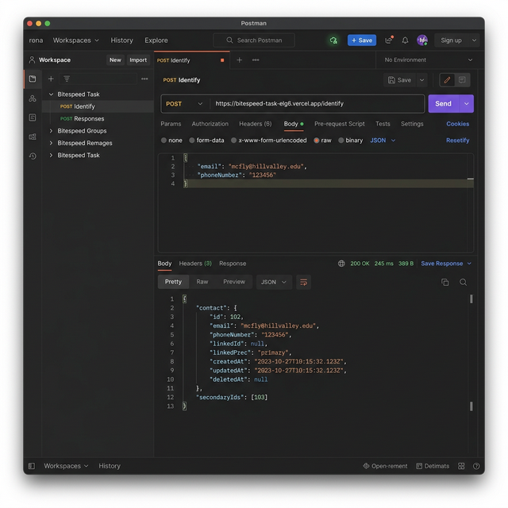

# Bitespeed Identity Reconciliation Backend

A Node.js/TypeScript backend for identity reconciliation, built with Express and Prisma.

## Endpoint
**POST** `/identify`

### Request Body
```json
{
  "email": "mcfly@hillvalley.edu",
  "phoneNumber": "123456"
}
```

## 🚀 Live Service
The backend is live and accessible at:
- **Service URL**: [https://bitespeed-task-elg6.vercel.app](https://bitespeed-task-elg6.vercel.app)
- **Identify Endpoint**: `https://bitespeed-task-elg6.vercel.app/identify`

## 🖼️ Visual Documentation

### 🗄️ Database (Prisma & Supabase)
Successfully integrated Prisma with Supabase. The screenshot below shows the `Contact` table with reconciled identities (primary and secondary links).



### 📮 Postman API Testing
Tested the `/identify` endpoint with various payloads to verify the identity reconciliation logic.



> [!TIP]
> You can test the service directly using the Postman collection or by sending a POST request to the Identify endpoint above.

## Setup & Deployment

### 1. Database Setup (Supabase)
1. Create a new project on [Supabase](https://supabase.com/).
2. Go to **Project Settings > Database** and copy the **Transaction** connection string.
3. Create a `.env` file in the root directory:
   ```env
   DATABASE_URL="your_supabase_connection_string"
   ```

### 2. Local Development
```bash
npm install
npx prisma generate
npx prisma db push
npm run dev
```

### 3. Deployment
- **Vercel**: Link your GitHub repo, add the `DATABASE_URL` as an environment variable, and deploy.
- **Render**: Create a new Web Service, link your repo, and add `DATABASE_URL`.
